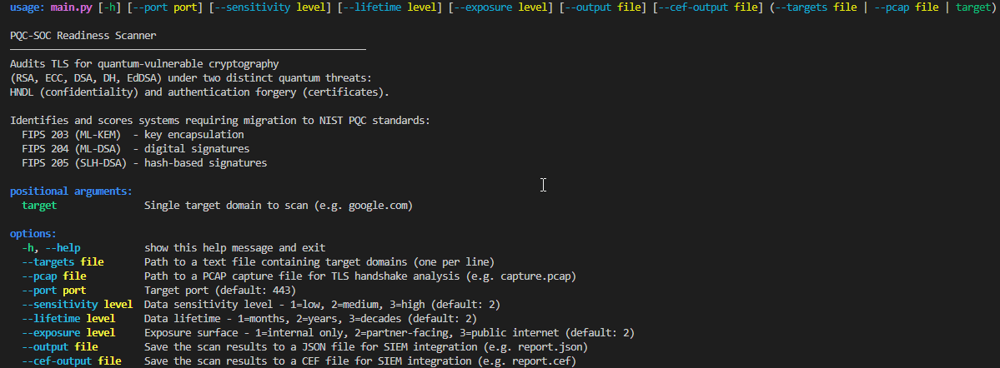

# PQC-SOC Readiness Scanner
 
> **Q-Day isn't the beginning of the threat. It's the end of the grace period.**
 
[](LICENSE)
[](https://www.python.org/)
[](https://github.com/surendrababu-sec/pqc-soc-readiness)
[](https://csrc.nist.gov/projects/post-quantum-cryptography)
[](https://github.com/surendrababu-sec/pqc-soc-readiness)

An independent research project and open-source Python tool auditing organisations' public-facing TLS endpoints and network captures for quantum-vulnerable cryptography. The scanner measures two distinct quantum threats - Harvest-Now, Decrypt-Later (HNDL) on the confidentiality side, and authentication forgery exposure on the certificate side - and scores both using the same model, labelled by the threat each finding actually represents.
 
Every output traces back to a specific NIST standard, a documented threat, and a weighted risk score the analyst can interrogate.
 
---
 
## Demo
 
https://github.com/surendrababu-sec/pqc-soc-readiness/raw/main/assets/demo.mp4
 
> *Live certificate scan demo. PCAP output is shown in the [Sample Output](#sample-output) section below.*
 
---
 
## Table of Contents
 
- [The Problem](#the-problem)
- [What This Does](#what-this-does)
- [How It Works](#how-it-works)
- [The Quantum Exposure Scoring Model](#the-quantum-exposure-scoring-model)
- [Installation](#installation)
- [Usage](#usage)
- [Sample Output](#sample-output)
- [Research Foundation](#research-foundation)
- [Current State](#current-state)
- [Repository Structure](#repository-structure)
- [Roadmap](#roadmap)
- [Manuscript](#manuscript)
- [How to Cite](#how-to-cite)
- [Contributing](#contributing)
- [License](#license)
- [Author](#author)
---
 
## The Problem
 
Most organisations assume their encryption is secure. It isn't - not against what's coming.
 
The cryptography protecting healthcare records, financial transactions, government communications, and critical infrastructure today relies on mathematical problems - integer factorisation (RSA) and the discrete logarithm (ECC) - that a sufficiently powerful quantum computer will solve using Shor's algorithm. Nation-state adversaries are already harvesting encrypted traffic today, archiving it for the day quantum capability arrives. For data with long-term sensitivity, the compromise is **already happening** - silently - even though the decryption hasn't yet.
 
NIST finalised the post-quantum replacements in 2024 (FIPS 203, 204, 205). Migration must begin now. But organisations cannot migrate what they cannot see. Most have no inventory of where their quantum-vulnerable cryptography lives.
 
**This project is the diagnostic instrument for that migration.**

Two distinct quantum threats are in scope: HNDL, which threatens confidentiality, and authentication forgery, which threatens trust in the certificate chain itself. The scanner measures and scores both.
 
### Threat Model: HNDL
 
| Property | Implication |
|----------|-------------|
| Attack happens **today** | Encrypted traffic is intercepted and archived now - no alarms, no detection |
| Decryption happens **later** | Adversary waits for sufficient quantum capability to arrive |
| Affects **long-lived data** | Patient records, financial transactions, IP, classified material |
| Mitigation requires **migration**, not just monitoring | Defenders cannot retroactively unencrypt what is already harvested |
 
HNDL inverts the usual security calculus: the longer the data's sensitivity lifetime, the more urgent the migration - even if Q-Day itself is years away.

### Threat Model: Authentication Forgery

A certificate's public key is not secret - it is broadcast on every handshake and logged permanently in Certificate Transparency. There is nothing to harvest, because nothing is hidden. What breaks once a quantum computer can solve the underlying problem is the ability to forge new signatures from that public key - impersonating the server going forward.

| Property | HNDL (confidentiality) | Authentication forgery |
|----------|------------------------|-------------------------|
| What's at risk | Past session keys | Future signatures |
| Attack timing | Retroactive | Prospective |
| Requires harvesting today? | Yes | No - the public key is already public |
| Where it shows up | Key exchange (ECDHE, RSA key transport, DH) | Certificates (ECDSA, RSA, DSA, EdDSA signatures) |

The scanner scores both threats using the same four-factor model, but labels each finding with the threat it actually represents - confidentiality risk for key exchange findings, authentication risk for certificate findings - so the migration advice and rationale never conflate the two.

---
 
## What This Does
 
The scanner operates in two complementary modes:
 
**Certificate mode** - connects to a live TLS endpoint, pulls its certificate, identifies the algorithm and key size, scores the quantum exposure under the authentication forgery threat, and recommends the migration path. Results appear immediately in the terminal with colour-coded severity, and can be saved as SIEM-ready JSON or CEF.
 
**PCAP mode** - reads a network capture file, reconstructs TLS handshake sessions from the packets, identifies which cipher suites and key exchange groups were negotiated, and scores each finding under the HNDL confidentiality threat. Key sizes are resolved with algorithm-aware precision:

- **ECC key exchange** : The key size comes from the TLS group negotiated in the handshake itself, not the certificate. For TLS 1.3 sessions where the Server Hello was captured, the scanner extracts the exact group from the KeyShare extension. Where only the Client Hello is available, it uses the most conservative group the client offered - erring on the side of higher risk. The certificate's own key is never used here, because in ECDHE the certificate handles authentication, not key exchange.
- **RSA key exchange** : The certificate key is the exchange mechanism itself, so the scanner reads the key size from any certificate captured in the PCAP, attempts a brief live fetch if none was captured, and falls back to the documented RSA-2048 deployment baseline as a last resort.

Each finding is labelled with its key size source (`negotiated_group`, `supported_group`, `pcap_certificate`, `live_fetch`, or `modal_baseline`) so the methodology behind every score is fully transparent. PCAP mode scores the key exchange layer only - to assess a certificate's own forgery exposure, run certificate mode against the same endpoint directly.
 
Both modes produce the same output structure: a colour-coded CLI table, algorithm-specific migration advice, and optionally a timestamped JSON report or CEF file for SIEM ingestion.
 
---
 
## How It Works
 
```
┌──────────────────────────────────────────────────────────────┐
│  INGESTION                                                   │
│  Live TLS endpoints  ·  PCAP captures  ·  File of targets    │
└─────────────────────────────┬────────────────────────────────┘
                              ▼
┌──────────────────────────────────────────────────────────────┐
│  CRYPTOGRAPHIC ANALYSIS                                      │
│  Algorithm family  ·  Key size  ·  Cipher suite  ·  Groups   │
└─────────────────────────────┬────────────────────────────────┘
                              ▼
┌──────────────────────────────────────────────────────────────┐
│  QUANTUM RISK ENGINE                                         │
│  Quantum exposure score  ·  Threat category  ·  NIST mapping │
└─────────────────────────────┬────────────────────────────────┘
                              ▼
┌──────────────────────────────────────────────────────────────┐
│  REPORTING                                                   │
│  Rich CLI table ·  SIEM-ready JSON  ·  CEF                   │
└──────────────────────────────────────────────────────────────┘
```
 
**Detection targets:** RSA, ECC, DH, DSA, EdDSA - and identification of already-deployed PQC (ML-KEM, ML-DSA, SLH-DSA) and hybrid groups (X25519+ML-KEM).
 
**Recommendation targets:** FIPS 203 (ML-KEM), FIPS 204 (ML-DSA), FIPS 205 (SLH-DSA), with hybrid mode guidance during the transition period.
 
---
 
## The Quantum Exposure Scoring Model
 
This is the original research contribution at the heart of the scanner. Rather than a binary vulnerable/not-vulnerable flag, each finding receives a weighted exposure score that reflects the urgency of migration in context. The same four-factor model scores both quantum threats - confidentiality and authentication forgery. The formula is identical for both. What changes is the label attached to each finding - confidentiality risk for key exchange findings, authentication risk for certificate findings and that label is what determines how the score should be read.

This model is original methodology developed specifically for this project. There is no existing standard for scoring HNDL or authentication forgery exposure the way CVSS scores general vulnerability severity - CVSS is the closest structural analog, in that both combine a base technical factor with contextual modifiers into a single comparable number. The full derivation and validation of this model will be formalised in the forthcoming arXiv preprint.
 
```
Quantum Exposure Score =
 
  [ (0.4 × algorithm_risk) + (0.2 × data_sensitivity) + (0.2 × data_lifetime) + (0.2 × exposure_surface) ]
  ────────────────────────────────────────────────────────────────────────────────────────────────────────  × 100
                                            max_possible_score
```
 
**Algorithm risk** is determined by the cryptographic family and key size:
 
| Algorithm | Key / Curve | Risk Score | Rationale |
|-----------|-------------|------------|-----------|
| RSA | < 2048 bits | 3 | Immediately at risk - act now |
| RSA | 2048 bits | 2 | Standard deployment - medium urgency |
| RSA | > 2048 bits | 1 | Larger key - still vulnerable, lower urgency |
| ECC | < 256 bits | 3 | Small curve - act immediately |
| ECC | 256 bits | 2 | P-256 standard - medium urgency |
| ECC | > 256 bits | 1 | Larger curve - still vulnerable, lower urgency |
| EdDSA (Ed25519) | 256 bits | 2 | Elliptic-curve based, same urgency as standard ECC |
| EdDSA (Ed448) | 448 bits | 1 | Larger curve, still vulnerable, lower urgency |
| DH / DSA | - | 2 | Quantum vulnerable - medium urgency |
| ML-KEM / ML-DSA / SLH-DSA | - | 0 | Already post-quantum safe |
 
**Context factors** - each rated 1 (low) to 3 (high):
 
| Factor | 1 | 2 | 3 |
|--------|---|---|---|
| `data_sensitivity` | Public data | Internal use | Highly sensitive |
| `data_lifetime` | Months | Years | Decades |
| `exposure_surface` | Internal only | Partner-facing | Public internet |
 
All three default to 2 - a fair middle-ground assumption when context is not specified. Override them with `--sensitivity`, `--lifetime`, and `--exposure` flags to reflect the actual environment being assessed.
 
**Severity thresholds:**
 
| Score | Severity | Suggested Action |
|-------|----------|-----------------|
| 75 - 100 | CRITICAL | Act immediately |
| 50 - 74 | HIGH | Plan this quarter |
| 25 - 49 | MEDIUM | On the roadmap |
| 0 - 24 | LOW | Monitor |
 
The weights and max values live in [`scanner/knowledge/quantum_exposure_rubric.yaml`](scanner/knowledge/quantum_exposure_rubric.yaml) - auditable independently of the code.
 
---
 
## Installation
 
```bash
git clone https://github.com/surendrababu-sec/pqc-soc-readiness.git
cd pqc-soc-readiness
 
# Create and activate a virtual environment
python -m venv venv
venv\Scripts\activate      # Windows
source venv/bin/activate   # macOS / Linux
 
pip install -r requirements.txt
```
 
**Keep up to date:**
 
```bash
git pull
pip install -r requirements.txt
```
 
---
 
## Usage
 
### Scan a single TLS endpoint
 
```bash
python scanner/main.py google.com
```
 
### Scan with a custom risk context
 
When you know the sensitivity of the data or the exposure of the endpoint, tell the scanner - it adjusts the quantum exposure score accordingly:
 
```bash
python scanner/main.py nhs.uk --sensitivity 3 --lifetime 3 --exposure 3
```
 
> `--sensitivity 3` = highly sensitive data (patient records, financial data)  
> `--lifetime 3` = data must stay secret for decades  
> `--exposure 3` = public-facing endpoint
 
### Scan on a non-standard port
 
```bash
python scanner/main.py example.com --port 8443
```
 
### Scan multiple targets from a file
 
```bash
python scanner/main.py --targets scanner/targets.txt
```
 
> `targets.txt` contains one domain per line. Edit it with your own targets.
 
### PCAP handshake analysis
 
Analyse a network capture file - the scanner reads directly from the file and resolves key sizes from the handshake data itself:
 
```bash
python scanner/main.py --pcap capture.pcap
```
 
The scanner reconstructs TLS sessions from the capture, identifies the cipher suites and key exchange groups that were negotiated, and produces a scored finding for each unique server endpoint. Migration advice is deduplicated - shown once per algorithm type, not once per session.
 
### Save results as a SIEM-ready JSON report
 
```bash
python scanner/main.py google.com --output report.json
 
python scanner/main.py --pcap capture.pcap --output pcap_report.json
```
 
> Reports save automatically to `scanner/output/` with a timestamp in the filename, so scans never overwrite each other.

### Save results as a CEF file for SIEM ingestion

CEF (Common Event Format) is the native ingestion format for ArcSight, QRadar, and most legacy enterprise SOC pipelines. It can be requested alongside or instead of JSON:

```bash
python scanner/main.py google.com --cef-output report.cef

python scanner/main.py --pcap capture.pcap --output report.json --cef-output report.cef
```
 
### Show all available options
 
```bash
python scanner/main.py --help
```


 
---
 
## Sample Output
 
### Certificate scan - google.com
 
```
╭─────────────────────────────────────────────────────────────╮
│ PQC-SOC Readiness Scanner - Target: google.com              │
╰─────────────────────────────────────────────────────────────╯
┏━━━━━━━━━━━━━━━━━┳━━━━━━━━━━━━━━━━━┳━━━━━━━━━━━━━━━┳━━━━━━━━━━━━━━━━━━━━━━━━━━┳━━━━━━━━━━━━━━━━━━━━━━━━━━━━━━━━━━━━━━━━┳━━━━━━━━━━━━━━━┳━━━━━━━━━━━━━━━━━━━━━━━━┳━━━━━━━━━━┳━━━━━━━━━━━━━━━━━━━┓
┃ Target          ┃ Algorithm       ┃ Key Size      ┃ Vulnerable               ┃ Issuer                                 ┃ Expires       ┃ Quantum Exposure Score ┃ Severity ┃ NIST Standard     ┃
┡━━━━━━━━━━━━━━━━━╇━━━━━━━━━━━━━━━━━╇━━━━━━━━━━━━━━━╇━━━━━━━━━━━━━━━━━━━━━━━━━━╇━━━━━━━━━━━━━━━━━━━━━━━━━━━━━━━━━━━━━━━━╇━━━━━━━━━━━━━━━╇━━━━━━━━━━━━━━━━━━━━━━━━╇━━━━━━━━━━╇━━━━━━━━━━━━━━━━━━━┩
│ google.com      │ ECC (secp256r1) │ 256 bits      │ YES - Quantum Vulnerable │ CN=WR2,O=Google Trust Services,C=US    │ 30 Jul 2026   │ 66.67                  │ HIGH     │ FIPS 204 (ML-DSA) │
└─────────────────┴─────────────────┴───────────────┴──────────────────────────┴────────────────────────────────────────┴───────────────┴────────────────────────┴──────────┴───────────────────┘
╭────────────────────────────────────────────────────── Migration Advice ───────────────────────────────────────────────────────╮
│ Migrate certificate signatures from ECDSA to ML-DSA-65 (FIPS 204) - the post-quantum equivalent at the P-256 security level.  │
│ Note the operational impact: ML-DSA-65 signatures are approximately 50 times larger than ECDSA P-256 (3,309 versus 64 bytes), │
│ with corresponding handshake overhead. Deploy in hybrid mode during transition. For environments requiring conservative       │
│ assurance based on hash function security rather than lattice hardness, SLH-DSA (FIPS 205) is the approved alternative.       │
╰───────────────────────────────────────────────────────────────────────────────────────────────────────────────────────────────╯
```
 
### PCAP analysis - network capture (39 sessions detected)
 
```
╭────────────────────────────────────────────────────────────────────────────╮
│ PQC-SOC Readiness Scanner - PCAP Handshake Analysis                        │
╰────────────────────────────────────────────────────────────────────────────╯
┏━━━━━━━━━━━━━━━━━━━━━━━━┳━━━━━━━━━━━━━━━━━━━━━━━━━━┳━━━━━━━━━━━━━━━━━━┳━━━━━━━━━━━━━━━━━━━━━━━━━━━━━━━━━━━━━━━━━━┳━━━━━━━━━━━━━━━━━━━━━━━━┳━━━━━━━━━━━━━━━━┳━━━━━━━━━━━━━━━━━━━━━━━━━━━━━━┳━━━━━━━━━━━━━━━━━━━━━━━━━━━━━━━┓
┃ Server Endpoint        ┃ Client IP                ┃ Algorithm        ┃ Cipher Suite                             ┃ Quantum Exposure Score ┃ Severity       ┃ NIST Standard                ┃ Server Hello                  ┃
┡━━━━━━━━━━━━━━━━━━━━━━━━╇━━━━━━━━━━━━━━━━━━━━━━━━━━╇━━━━━━━━━━━━━━━━━━╇━━━━━━━━━━━━━━━━━━━━━━━━━━━━━━━━━━━━━━━━━━╇━━━━━━━━━━━━━━━━━━━━━━━━╇━━━━━━━━━━━━━━━━╇━━━━━━━━━━━━━━━━━━━━━━━━━━━━━━╇━━━━━━━━━━━━━━━━━━━━━━━━━━━━━━━┩
│ 10.100.109.133:3389    │ 10.128.2.74              │ RSA              │ TLS_RSA_WITH_AES_256_GCM_SHA384          │ 66.67                  │ HIGH           │ FIPS 203 (ML-KEM)            │ Yes                           │
│ 10.100.117.5:3389      │ 10.128.1.233             │ ECC              │ TLS_ECDHE_RSA_WITH_AES_256_GCM_SHA384    │ 66.67                  │ HIGH           │ FIPS 203 (ML-KEM)            │ Yes                           │
│ 192.168.220.44:6443    │ 192.168.220.45           │ ECC              │ TLS 1.3 with ECC                         │ 66.67                  │ HIGH           │ FIPS 203 (ML-KEM)            │ Yes                           │
│ ... 36 more sessions   │                          │                  │                                          │                        │                │                              │                               │
└────────────────────────┴──────────────────────────┴──────────────────┴──────────────────────────────────────────┴────────────────────────┴────────────────┴──────────────────────────────┴───────────────────────────────┘
╭──────────────────────────────────────── Migration Advice - ECC ─────────────────────────────────────────╮
│ Migrate key exchange from ECDH to ML-KEM-768 (FIPS 203). Deploy in hybrid mode alongside X25519 during  │
│ transition, this is the X25519MLKEM768 pattern already in production at Google and Cloudflare since     │
│ 2024. Prioritise endpoints carrying long-lived or sensitive data first, as those are the primary        │
│ harvest-now-decrypt-later targets.                                                                      │
╰─────────────────────────────────────────────────────────────────────────────────────────────────────────╯
╭──────────────────────────────────────── Migration Advice - RSA ─────────────────────────────────────────╮
│ RSA key transport was removed from TLS 1.3 entirely, detecting it here means this endpoint is running   │
│ TLS 1.2 or earlier. Migration requires both a key exchange upgrade to ML-KEM-768 (FIPS 203) and a TLS   │
│ protocol upgrade to TLS 1.3. During TLS 1.3 deployment, run ML-KEM in hybrid mode alongside X25519 for  │
│ the transition period. All session keys derived from RSA key transport today are retroactively          │
│ decryptable once a sufficiently powerful quantum computer exists, this endpoint is directly exposed to  │
│ the harvest-now-decrypt-later threat.                                                                   │
╰─────────────────────────────────────────────────────────────────────────────────────────────────────────╯

Sessions analysed  : 39
Vulnerable         : 39
Hybrid PQC         : 0
Post-quantum safe  : 0
Unknown            : 0
```
 
*Migration advice is shown once per algorithm type - not once per session.
 
---
 
## Research Foundation
 
The scanner is built on a structured independent study of the mathematical foundations of post-quantum cryptography. The detection and scoring logic is original. The tool uses standard libraries for certificate parsing and packet reading, but the quantum exposure scoring model, algorithm classification, and migration guidance are written from scratch and grounded in this research.
 
**Lattice-based cryptography**

- Polynomial rings of the form *R*<sub>q</sub> = ℤ<sub>q</sub>[x]/(x<sup>n</sup> + 1)
- Module Learning With Errors (MLWE) and the decisional variant (D-MLWE)
- Why no known quantum algorithm efficiently solves these problems, and why that matters for the long-term security of ML-KEM and ML-DSA
  
**CRYSTALS-Kyber (ML-KEM, FIPS 203)**

- Full key generation, encapsulation, and decapsulation construction
- IND-CPA → IND-CCA2 hardening via the Fujisaki-Okamoto transform
- Parameter sets (ML-KEM-512/768/1024) and their security/overhead trade-offs
- Why ML-KEM-768 is the recommended default for most deployments
  
**CRYSTALS-Dilithium (ML-DSA, FIPS 204)**

- Schnorr signature scheme foundations and the lattice adaptation
- Rejection sampling, HighBits/LowBits decomposition, hint vectors
- Full ML-DSA scheme construction: key generation, signing, verification, correctness argument
- Parameter sets (ML-DSA-44/65/87) - key and signature sizes at each level
- Why ML-DSA-65 signatures are approximately 50× larger than ECDSA P-256, and what that means operationally
  
**Classical cryptographic failure under Shor's algorithm**

- The mathematical basis for RSA and ECC vulnerability
- Quantum complexity of integer factorisation and the discrete logarithm
- Why doubling the classical key size does not help against a quantum adversary
  
**NIST PQC standardisation**

- FIPS 203 (ML-KEM) - key encapsulation
- FIPS 204 (ML-DSA) - digital signatures
- FIPS 205 (SLH-DSA) - hash-based signatures as a conservative alternative
- Hybrid deployment considerations during the transition period
  
Full structured notes:

- [`MONTH-1-NOTES.md`](MONTH-1-NOTES.md) - HNDL threat landscape, RSA/ECC quantum failure, NIST standardisation
- [`MONTH-2-NOTES.md`](MONTH-2-NOTES.md) - CRYSTALS-Kyber mathematical structure, ML-KEM construction
- [`MONTH-3-NOTES.md`](MONTH-3-NOTES.md) - CRYSTALS-Dilithium mathematical structure, ML-DSA construction
- [`RESEARCH-NOTES.md`](RESEARCH-NOTES.md) - Master index across all research notes
  
---
 
## Current State
 
Honesty matters more than ambition. Here is exactly where this project stands today:
 
| Component | State |
|-----------|-------|
| HNDL threat model formalisation | ✅ Complete |
| Mathematical foundations - CRYSTALS-Kyber (ML-KEM) | ✅ Complete |
| Mathematical foundations - CRYSTALS-Dilithium (ML-DSA) | ✅ Complete |
| NIST FIPS 203/204/205 study | ✅ Complete |
| Scanner architecture and design | ✅ Complete |
| TLS certificate detection - RSA, ECC, DSA, DH, EdDSA | ✅ Complete |
| Multiple target scanning from file | ✅ Complete |
| Quantum exposure scoring engine | ✅ Complete - weighted 0-100 with configurable rubric |
| NIST migration recommendation engine | ✅ Complete - FIPS 203/204/205 mapped |
| Configurable risk context flags | ✅ Complete |
| JSON export for SIEM integration | ✅ Complete - includes failed scan details and urgency-first ordering |
| CEF export for SIEM integration | ✅ Complete - native ingestion format for ArcSight, QRadar |
| PCAP handshake analysis | ✅ Complete |
| Detection of hybrid PQC groups (X25519+ML-KEM, pure ML-KEM) | ✅ Complete |
| Hybrid PQC adoption reported as its own category | ✅ Complete |
| Dual quantum threat taxonomy (confidentiality vs authentication) | ✅ Complete |
| Algorithm-aware ECC key size resolution from TLS groups | ✅ Complete |
| TLS 1.3 KeyShare extraction for exact negotiated group key size | ✅ Complete |
| arXiv manuscript | 🟡 In preparation |
 
✅ = complete · 🟡 = in progress · ⏳ = planned
 
---
 
## Repository Structure
 
```
pqc-soc-readiness/
├── scanner/
│   ├── modules/
│   │   ├── certificate_analyser.py   # TLS certificate detection and parsing
│   │   ├── risk_engine.py            # Quantum exposure scoring engine and NIST recommendations
│   │   └── pcap_analyser.py          # PCAP handshake analysis and key size resolution
│   │   └── cef_writer.py             # CEF output - escaping, severity mapping, event building
│   ├── knowledge/
│   │   ├── quantum_exposure_rubric.yaml  # Scoring weights and max values - auditable
│   │   ├── nist_mappings.yaml            # Expert-level NIST PQC migration mappings
│   │   ├── cipher_suites.csv             # Full IANA TLS cipher suite registry (356 suites)
│   │   └── supported_groups.csv          # Full IANA TLS supported groups registry (57 groups)
│   ├── test_captures/                # Sample PCAP files for development and testing
│   ├── output/                       # Scan results - auto-created, gitignored
│   ├── targets.txt                   # Example target domains - edit with your own
│   └── main.py                       # CLI entry point
├── assets/
│   ├── demo.gif                      # Tool demo
│   └── help_screenshot.png           # CLI --help output
├── MONTH-1-NOTES.md                  # Month 1 - HNDL threat landscape and foundations
├── MONTH-2-NOTES.md                  # Month 2 - CRYSTALS-Kyber mathematics
├── MONTH-3-NOTES.md                  # Month 3 - CRYSTALS-Dilithium mathematics
├── RESEARCH-NOTES.md                 # Master index across all research notes
├── requirements.txt                  # Python dependencies - pinned versions
├── LICENSE                           # MIT
└── README.md                         # This file
```
 
The `knowledge/` folder is kept as data, not code. Weights, mappings, and IANA registry data can be updated independently of the codebase - which matters as NIST guidance evolves.
 
---
 
## Roadmap
 
This project is structured as a phased independent research programme. Current phase: **Phase 3 complete - preparing Phase 4**.
 
**Phase 1 - Foundation** ✅ *Complete*

- Mathematical foundations of ML-KEM and ML-DSA
- HNDL threat model formalisation and scoring model design
- Scanner architecture
  
**Phase 2 - Detection and Risk Engine** ✅ *Complete*

- TLS endpoint probing and certificate analysis
- Multiple target scanning from file
- Quantum exposure scoring engine
- NIST migration recommendation engine
- Configurable risk context flags
- JSON export for SIEM integration
  
**Phase 3 - Reporting and Network Analysis** ✅ *Complete*

- PCAP-based handshake analysis ✅
- Detection of hybrid PQC groups (X25519+ML-KEM, pure ML-KEM) ✅
- Dual quantum threat taxonomy - confidentiality vs authentication forgery ✅
- Algorithm-aware ECC key size resolution from TLS handshake groups ✅
- TLS 1.3 KeyShare extraction for exact negotiated group key size ✅
- SIEM-ready CEF output format ✅
- JSON report enhancements - failed scan details, urgency-first ordering ✅
- Documentation pass ✅
  
**Phase 4 - Manuscript and Release** 🟡 *In progress*
- arXiv preprint preparation
- v0.1 release
- Final documentation and community release
  
---
 
## Manuscript
 
> **PQC-SOC Readiness: Auditing Organisations' Public-Facing TLS Endpoints and Network Captures for Quantum-Vulnerable Cryptography Under the HNDL and Authentication Forgery Threat Models**
>
> Surendra Babu Chilakaluru
>
> *Manuscript in preparation. Target: arXiv cs.CR, 2026.*
 
The manuscript will document the quantum exposure scoring model and its dual application to confidentiality and authentication forgery threats, the algorithm-aware key size resolution methodology for PCAP analysis, the detection methodology across both certificate and PCAP modes, and a structured analysis of quantum-vulnerable cryptography observed across a range of endpoints. The scanner is the measurement tool; the paper is the research contribution.
 
---
 
## How to Cite
 
Until the manuscript is published, you may cite this repository:
 
```bibtex
@misc{surendrababu_pqc_soc_2026,
  author       = {Chilakaluru, Surendra Babu},
  title        = {PQC-SOC Readiness Scanner: Auditing Organisations' Public-Facing TLS Endpoints and Network
                  Captures for Quantum-Vulnerable Cryptography Under the HNDL and Authentication Forgery Threat Models},
  year         = {2026},
  howpublished = {\url{https://github.com/surendrababu-sec/pqc-soc-readiness}},
  note         = {Independent research project and open-source tool - Phase 3 complete, manuscript in preparation}
}
```
 
---
 
## Contributing
 
Feedback, issues, and pull requests are welcome - especially on the quantum exposure scoring model and its weights. If you spot something technically wrong, have a suggestion on the rubric, or are working on NIST PQC migration yourself and want to compare notes, open an issue or start a discussion.
 
Things that would particularly help:
- Additional PCAP captures containing PQC or hybrid key exchange sessions for testing
- Review of the quantum exposure scoring model weights and their justification
- Feedback on the migration advice entries in `nist_mappings.yaml`
- Testing the CEF output against your own SIEM environment
---
 
## License
 
Released under the [MIT License](LICENSE).
 
---
 
## Author
 
**Surendra Babu Chilakaluru**
 
MSc Information Security & Digital Forensics - Distinction, University of East London. Independent researcher in post-quantum cryptography and security operations. Based in London, UK.
 
Connect: [LinkedIn](https://www.linkedin.com/in/surendra-babu-chilakaluru/) · [GitHub](https://github.com/surendrababu-sec)
 
---
 
*Independent research, conducted outside any academic programme, funded by the author's own time, and documented publicly with a full timestamped commit history from day one.*
